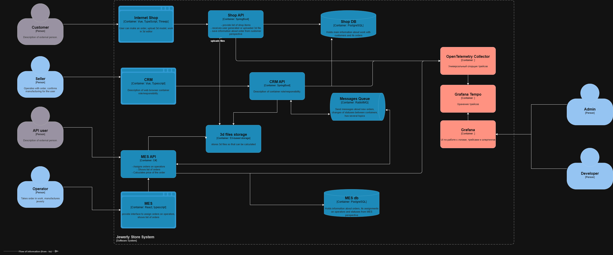

# Анализ 

Наиболее уязвимые для ошибок места - во взаимодействии между сервисов:
CRM API -> RabbitMQ
или 
RabbitMQ -> MES APi
или 
MES API -> MES db

Но для получения исчерпывающей информации о жизненном цикле заказа, необходимо включить в систему трейсинга все backend-сервисы, а именно:
- Shop API
- CRM API
- MES API 

Сервисы frontend`а можно включить в систему трейсинга позже, либо вообще не включать в целях экономии ресурсов и времени разработчиков.

Поля, которые должны быть в трейсе:
- Уникальный ID заказа (OrderId)
- ID трейса (TraceId)
- ID пользователя (UserId)
- ID операции, внутри сервиса (SpanID)
- Название сервиса (ServiceName)
- Временные метки вдоха и выхода из сервиса 
- Http Status Code
- Подтверждение получения сообщения в RabbitMQ
- Параметры запросов API (Qeury-params, route, возможно, headers) 

# Мотивация 
- Ускорение диагностики инцидентов - сокращается время на поиск и агреггирование информации.
- Потенциал для автоматизации QA и алёртинга - можно добавить детекторы/триггеры на запросы из жизненного цикла заказа.
- Повышение прозрачности системы - улучшает понимание процессов (особенно важно для новичков) системы наглядным представлением.
- Обнаружение узких мест в системе, трейсинг помогает оптимизировать частые и критические важные пути запросов, за счёт представленной наглядной информации

Введение трейсинга позволит:
- Уменьшить время работы над тикетом для тех. поддержки
- Уменьшить % потерянных заказов
- Уменьшить MTTR (среднее время, необходимое для ремонта системы или компонента после сбоя)
- Снижение Downtime Costs (потерь от простоев), за счёт быстрого поиска и устранения ошибок

# Предлагаемое решение

Новые компоненты:
- OpenTelemetry Collector
- Grafana Tempo
- Grafana (Frontend)

OpenTelemetry Collector: 
- Это сервис-посредник, который принимает, обрабатывает и экспортирует телеметрические данные (traces, metrics, logs). 
- Он не зависит от поставщика данных и позволяет унифицировать сбор данныъ

Grafana Tempo:
- backend для хранения трейсов
- Отлично интегрируется с Grafana

Grafana:
- Единая панель для визуализации метрик, логов и алертинга.
- Поддерживает множество источников данных: Prometheus, Loki, и др.
- Позволяет строить дашборды, настраивать алерты, исследовать данные.
- Имеет встроенную авторизацию, распределение доступа по ролям, аудит запросов.

# Компромисы

Возможные помехи и проблемы при внедрении трейсинга. 
- Проблема интеграции для 'закрытого' ПО, потребуются правки от вендора.
- Для компонентов SaaS, когда мы не контролируем сеть и софт компонента системы.
- Устаревние языки или технологии, которые не имеют реализованных интеграций OpenTelemetry
- Долгое хранение трейсов - дорого, как вариант - хранить детальные трейсы 7-30 дней, затем архивировать и хранить в S3 до удаления.
- Сбор и отгрузка трейсов замедляет выполнение запросов и увеличивает нагрузку на сеть, что может быть проблемным, для чувствительных к произмодительности системах. Для систем можно использовать сэмплирование, т.е. делать трейсинг, например, только 25% запросов. 

# Безопасность 
Информация в трейсинговой системе содержит чувстительную о параметрах запросов, API, архитектуре системы. 
А так же на основе анализа трейсингов можно получить информацию о финасовых успехах (или нет) компании, (например количество успешно выполненных заказов за месяц/неделю).

Поэтому доступ к трейсинговой системе должен соотвествовать критериям безопасности:
- Доступ только авторизованным пользователям
- Разделить доступы на роли Support, Developer, Admin (Support может просматривать только трейсы по жизненному циклу заказов)
- Шифрование трафика по TLS
- Аудит запросов (сохранять все запросы к системе трейсинга)
- Очистка персональных данных
- Доступ к системе трейсинга только из корпоративной сети
- Нельзя трейсить персональные данные