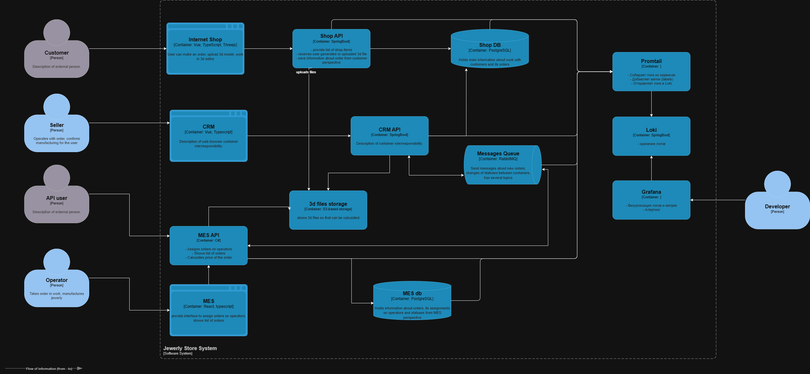

## События уровня INFO:
|Источник|Событие|Поля|
|--|--|--|
|Shop API|Создание заказа|time, orderId, userId, itemsCount, totalAmount|
|Shop API|Изменение статуса заказа|time, orderId, userId, oldStatus, newStatus|
|Shop API|Статус транзакций в БД|message, exeption|
|MES API|Заказ создан|time, orderId, userId, itemsCount, totalAmount|
|MES API|Заказ отправлен в очередь|time, orderId, userId|
|CRM API|Заказ получен из очереди|time, order_id, userId|
|CRM API|Статус транзакций в БД|message, exeption|

Другие уровни логгирования:
* DEBUG - для логгирования параметров запросов в другие API или вызова методов, изменение состояний сущностей.
* WARNING - При ошибках авторизации, временных сбоях, долгих ответах.
* Error - ошибки транзакции, недоступность сервисов, не валидное состояние сущности.

# Мотивация 

- Улучшает понимание системы - детализированный набор событий показывает как и на что реагирует система.
- Восстановление состояния сущностей - помогает в расследовании или восстановлении данных при небольших инцидентах с потерей информации и/или состояния.
- Выявление аномалий по анализу логов.
- Безопасность - логи важный элемент аудита, сохрание данных о том, что, кто и как совершал операции.
- Автоматизация - создаёт потенциал по автоматизации уведомлений, в случае сбоев, или мошеннической активности. 

Введение логирования позволит улучшить метрики:
- Уменьшится MTTR (Среднее время устранения инцидента), за счёт доступности информации об инциденте.
- Time to Detect (TTD) Incidents (Время между возникновением ошибки и её обнаружением), Без логов и алертинга инцидент может быть замечен только через жалобы пользователей, либо вообще не замечен
- Anomaly Detection Rate (Количество выявленных аномалий или подозрительной активнрости), такие инциденты как DDoS или брутфорс будут заметны и их обнаружение можно автоматизировать

## Приоритеты

Во первых, необходимо сосредоточиться на системе сопровождения заказа, особое внимание уделить тем местам, где **изменяется** статус заказа, идеёт сохранение в DB, приём и отправка событий в очереди сообщений.

Пользователи MES API, сообщают о потерях заказо, с MES API и начнём.
Следующими будут CRM API и Shop API

1. Добаить логгирование в сервисы MES API, CRM API, Shop API, в указанном порядке

2. Введение трейсинговой системы для сервисов и инфраструктурных компонентов.

3. Добавить алерты на ключевые ошибки.

4. Улучшать систему мониторинга, добавляя покрытие процессов внутреннего и межкомандного взаимодействия.

# Предлагаемое решение

**Обновленная диаграма контейнеров:**
 

 

Доступ к Grafana получают admin, developer, служба поддержки и настраивается по системе ролей.

## Cбор и хранение логов - Loki
Что делает:
- Собирает, индексирует и хранит логи (не как полноценный ELK, а по меткам).
- Очень эффективен по памяти и диску - хранит логи как потоки с метками (labels), а не индексирует текст.
- Интегрируется с Grafana.

Компоненты:
- Promtail агент - парсит логи, добавляет метки и отправляет в Loki
- Loki Server - индексирует и хранит логи

##  Визуализация и дашборды - Grafana
Что делает:
- Единая панель для визуализации метрик, логов и алертинга.
- Поддерживает множество источников данных: Prometheus, Loki, и др.
- Позволяет строить дашборды, настраивать алерты, исследовать данные.

Компоненты:
- Grafana Server

## Безопасность
- Использовать маскировку или фильтрацию логов на уровне приложения
- Настроить доступ RBAC в Grafana (администратор, разработчик, техподдержка)
- Все соединения должны использовать HTTPS/TLS
- Включить аудит-логи в Grafana
- Loki и Grafana должны быть недоступны извне, только внутренняя сеть компании

## Хранение
Данные логов из разных сред разработки, должны находиться в разных индексах (таблицах/списках)
Логи из среды разработки и тестиривания - срок хранения 7 дней (низкая ценность)
Логи аутентицикации и оплаты - 90-180 дней (из требований по безопасности)
Логи с персональными данными - не более 30 дней (GDPR и ФЗ-152)
Основные сервисы - 30-90 дней (нужно найти баланс между стоимостью и возможностями диагностики)

При больших обьёмах данных, данные страше 30 дней можно архивировать и отправлять в S3 хранилище.

## Cистема анализа логов
Алертинг важный элемент мониторинга, без реагироввание на инциденты сильно замедлится, а иногда их можно и избежать заранее.

Рекомендуется:
- Внедрить алертинг, используя, например, пороговые значения или скользяшее среднее и т.д. 
- Формирование ежедневных/еженедельных отчетов по количеству ошибок и обнаруженным аномалиям.

Пример триггеров:
- Ошибки (5xx, 4xx, особенно 401/403 (попытки взлома))
- Рост времени ответа API, таймауты
- Отсутствие логов (перестали записываться)
- Резкий рост числа запросов
- Подозрительные запросы (один IP с разных геолокаций)
- Всплеск не типичных геолокаций запросов для сервиса 

# Дополнительное задание
|Критерий|ELK|OpenSearch|Splunk|Loki|
|--|--|--|--|--|
|Лицензия|SSPL/Elastic License   Бесплатная для базового использования но дорого при масштабе| Apache License, Version 2.0   Полностью open source |Проприетарная   Дорогая тарификация по GB в день|Apache License, Version 2.0   Полностью open source|
|Безопасность|В платной версии - Security, SSO, шифрование. В open source - ограничено|Аутентификация, шифрование, RBAC + ABAC, аудит, соответствие стандартам облачных решений |Полноценный SIEM, RBAC, аудит, шифрование, соответствие стандартам|Минимальные встроенные средства безопасности (требует интеграции с внешними системами)|
|Full-text search|Присутствует, отличная индексация|Присутствует, аналогичен ELK|Присутствует, глубокая индексация, ML, высокая производительность|Ограничен, нет индексации текста|
|Визуализация|Отличная визуализация с дашбордами|Отличная визулизация, аналогично ELK|Очень детальная и гибкая система визулизации|Отсутствует, требуется интеграция|
|Алертинг|Elastic Stack Alerting, гибкие условия и тригеры, но только в платной версии|Встроенный Alerting plugin|Встроенный гибкий и мощный, имеет real-time режим, ML детектор аномалий|Отсутствует, требуется интеграция|
