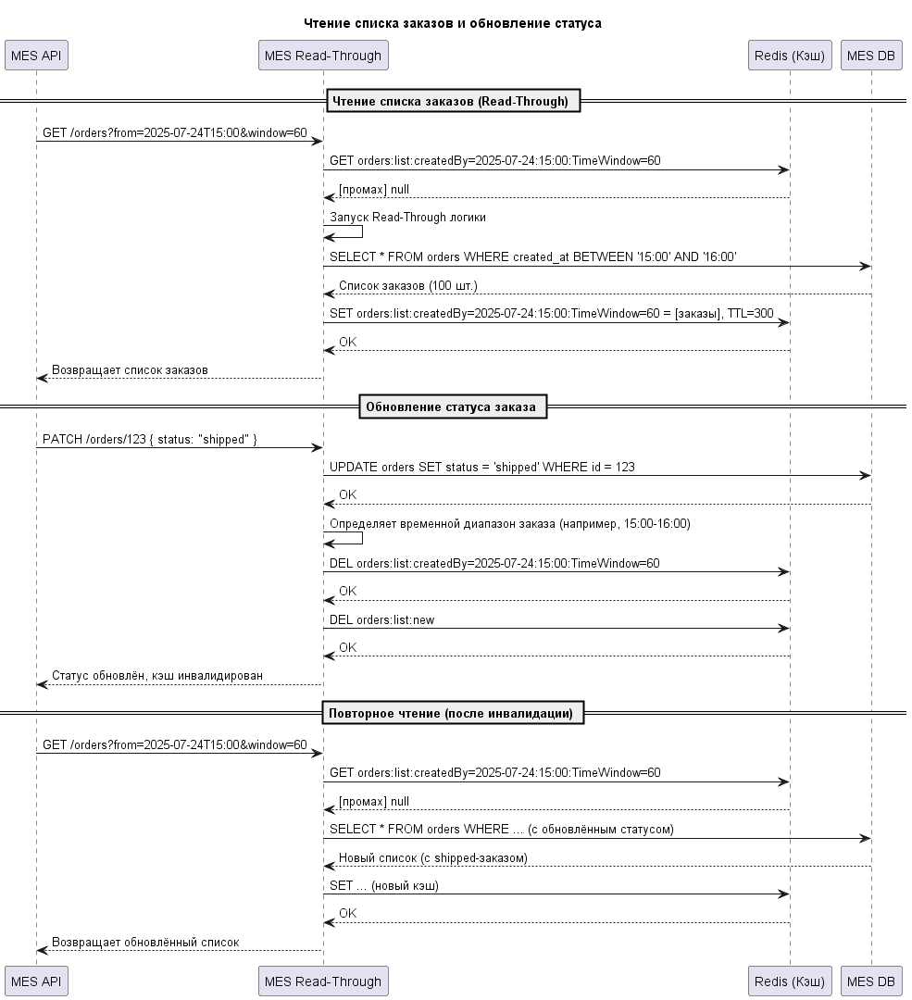

# Анализ
Пользователи жалуются на долгие ответы и создание заказов.
Из диаграмы текущего решения видно, что сервис 3d file storage используют сразу несколько сервисов, это может сильно нагружать сервис и сетевой трафик, особенно, если файлы большого обьёма. Это потенциально первый кандидат на внедрение кэширования.
Затем, внимание привлекает MES DB с которой также работают наши операторы и партнёры, в данный момент они залуются на долгую загрузку, вызванную, вероятно, высокой нагрузкой на MES DB и 3d file storage/

# Мотивация
Внедрение кеширования в систему привнесёт ряд положительных улучшений:
- Ускорение работы дашборда заказов для операторов, операторы будут быстро получать актуальную информацию о новых заказах и об изменении их статуса. 
- Снижение нагрузки на базу данных. Повторные запросы к БД заменяются чтением из кэша. Это уменьшает количество соединений, блокировок и нагрузку на сервер БД, что особенно важно при пиковых нагрузках.
- Масштабируемость
Кэширование позволяет системе обслуживать больше пользователей без пропорционального роста нагрузки на БД, что критично при росте числа заказов и операторов
-  Быстрый и отзывчивый интерфейс увеличивает удовлетворенность клиентов и сотрудников.

MES DB и 3d file storage имеют высокую нагрузку, что замедляет работу всей системы.

# Предлагаемое решение
## Кеширование файлового франилища
Установить между сервисами (MES API, CRM API, Shop API) и файловым франилищем 3d file storage новый сервис кэширования по патерну Read-Through.

Использование кеширования в RAM может быть очень дорогим, если файлы имеют большой размер.
В качестве компромиса, можно оставить сохранение на диск.

Паттерн: Read-Through
Хранилище: Redis
Ключ: file:{file_path}
Инвалидация: По ключу при обновлении файла.

Плюсы:
- Read-Through Сервис можно масштабировать независимо от S3
- Очень высокий буст скорости если храненить ответы полностью в Redis
- Централизовано, все клиенты получают одинаково быстрые ответы
- Инкапсуляция логики подгрузки - кэш "умный", знает, где взять данные
Минусы: 
- Дорого при больших файлах
- Усложнение инфраструктуры

Write-Through - не подходит, у нас чтение чаще записи.
Refresh-Ahead - довольно сложный, эффективность мала, т.к. данные меняются редко, а угадать какие данные понадобятся - сложно.
Cache-Aside - не подходит, дублирование логики кэширования в коде

~~ В качестве бесшовной альтернативы можно рассмотреть Proxy Cache nginx, в этом случае не нужно будет изменять код сервисов, они будут "думать" что обращаться к 3d file storage напрямую.

## Кеширование MES API -> MES Db
Паттерн: Read Through
Хранилище: Redis.
Ключи кэширования: 
```
 orders:list:createdBy={ДАТА}:TimeWindow={МИНУТЫ} 
 // делим результаты на временные куски, например, все заказы от 2025-24-07:15:00 и в течении  часа, чтобы не инвалидировать полностью всю коллекцию. 
 // ДАТА и МИНУТЫ нужно подстраивать под текущие характеристики системы, чтобы уменьшить кеш-промахи
 orders:list:new //самые новые заказы (сегодняшние), их кешируем отдельно
```
Список инвалидируется при изменении статуса заказа.

Плюсы:
- Более эффективным и масштабируемым, чем классический Cache-Aside
- Сегментация по временным окнам
- Инкапсуляция логики подгрузки - кэш "умный", знает, где взять данные
- Адаптивность, Размер TimeWindow можно менять динамически (например, 15/30/60 минут) в зависимости от нагрузки и hit-rate.

